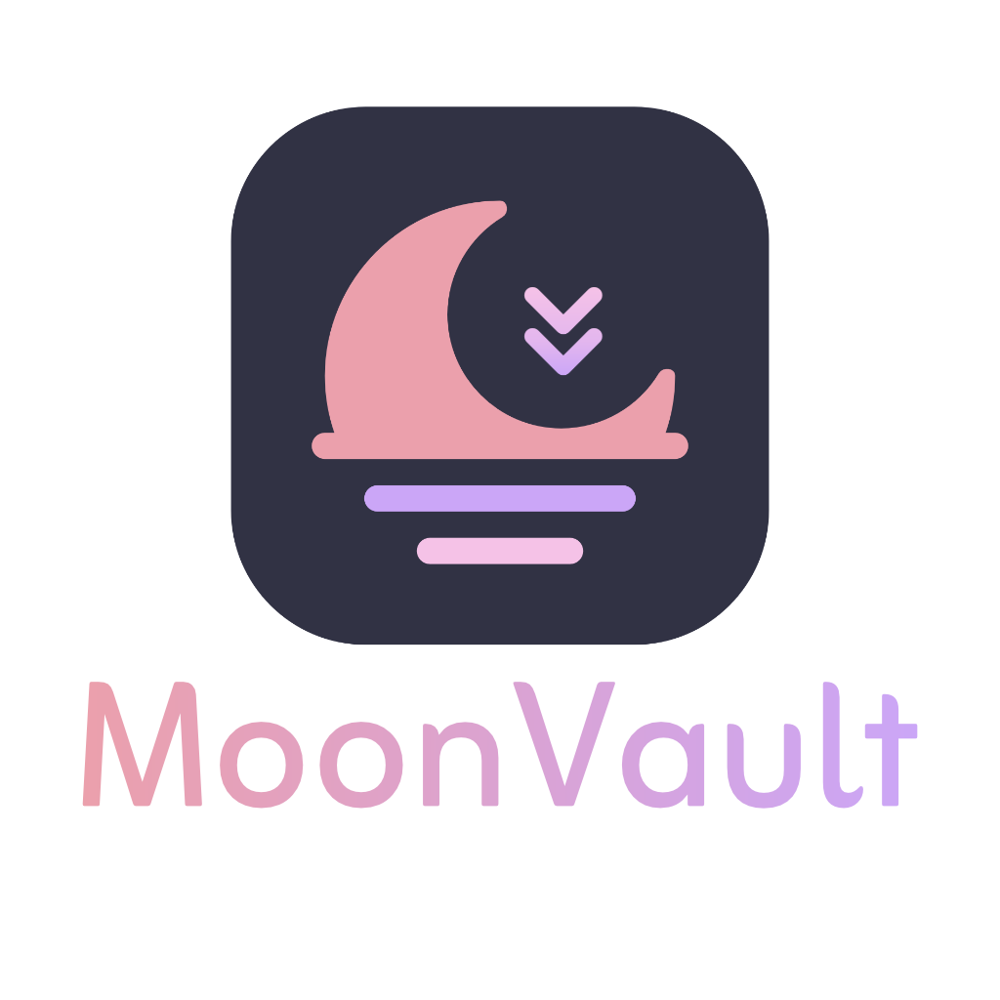
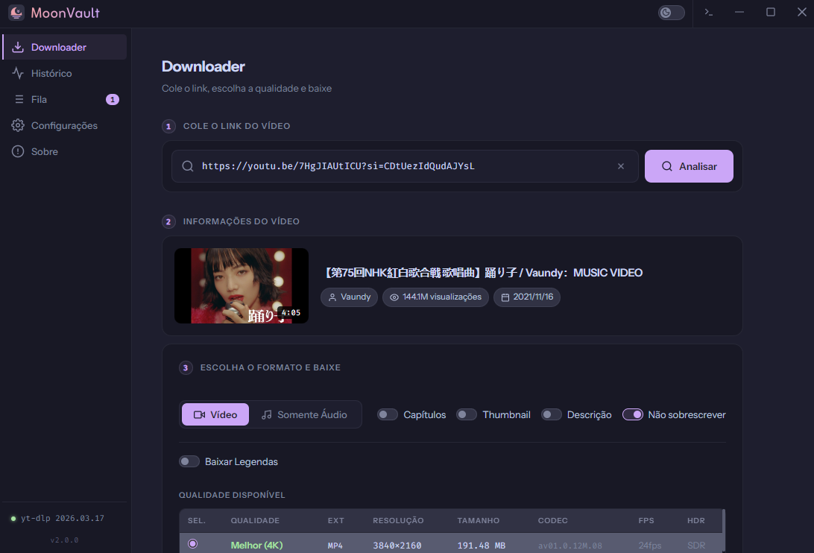
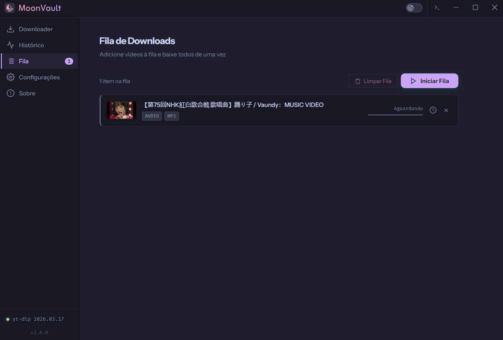
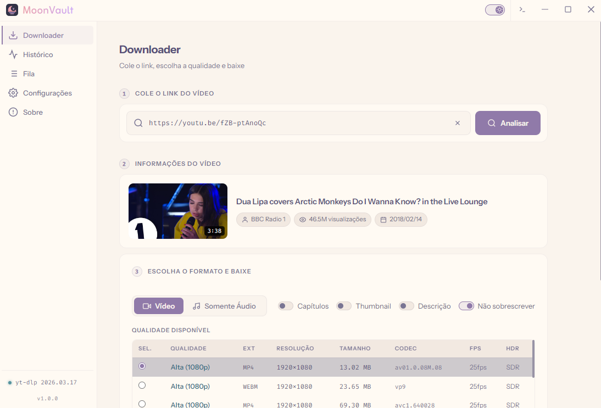
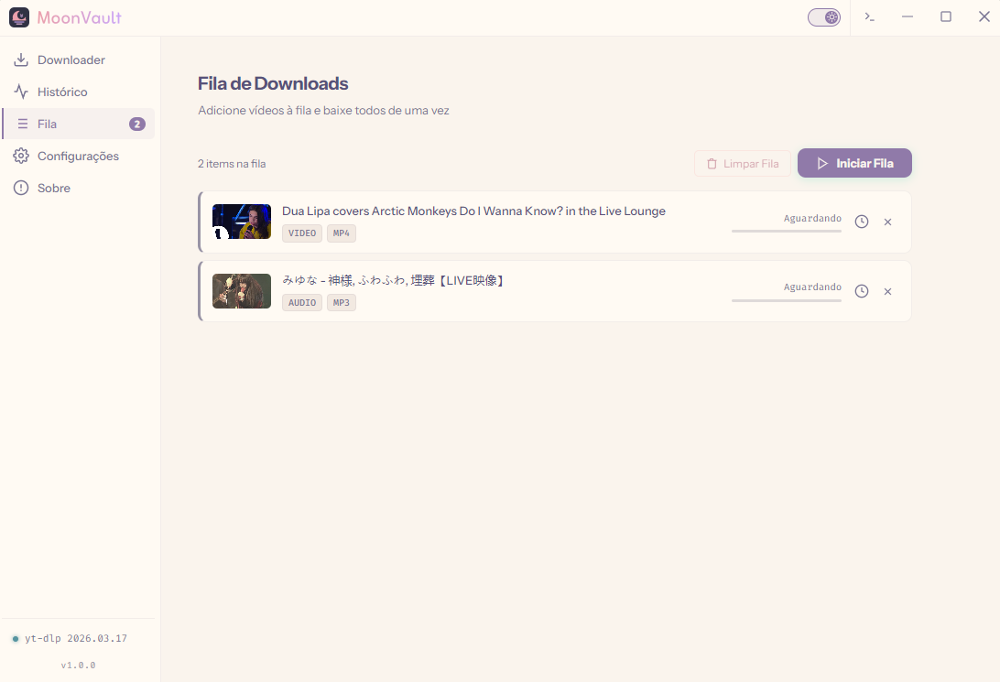

> [!NOTE]
> Em breve irei disponivilizar todo o código do programa aqui neste mesmo repositório, estou apenas organizando e comentando pontos importantes para que fique bem explicado.

<p align="center">
  
</p>

MoonVault é um aplicativo desktop para download de vídeos e áudios construído com Electron, FFmpeg e [yt-dlp](https://github.com/yt-dlp/yt-dlp). Ele oferece uma interface visual para configurar e executar downloads de centenas de plataformas, incluindo YouTube, Instagram, Twitter (X), TikTok e outras. Este é um "projeto de garagem", não tenho intenção de lucrar com o aplicativo, nem de torná-lo popular, até porque já existem muitos outros que fazem exatamente a mesma coisa. Ele foi feito com carinho para uso pessoal, porque eu queria uma interface bonita e algumas funções específicas, mas decidi deixá-lo disponível publicamente para amigos e quem encontrar e quiser baixar.

[](https://www.electronjs.org/)
[](https://github.com/BtbN/FFmpeg-Builds)
[]()

Inspirado no yt-dlp-GUI: https://github.com/kannagi0303/yt-dlp-gui

---

## Screenshots

| Screenshot Downloader (Dark Mode) | Screenshot Fila (Dark Mode) |
|---------|---------|
|  |  |
| Screenshot Downloader (Light Mode) | Screenshot Fila (Light Mode) |
|  |  |
---
## Funcionalidades

**Interface**
- Modo escuro ([Catppuccin Mocha](https://github.com/catppuccin)) e claro ([Rosé Pine Dawn](https://github.com/rose-pine))
- Moderna e leve, mas sem muita poluição

**Downloads**
- Vídeo em qualquer qualidade disponível (4K, 1080p, 720p, etc.)
- Áudio com conversão para MP3, M4A, OPUS, FLAC ou WAV
- Incorporação de capítulos, legendas e thumbnail no arquivo
- Suporte a playlists com seleção individual de itens
- Nome de arquivo personalizado antes de baixar
- Pasta de destino configurável por download, sem alterar o padrão global

**Fila**
- Adicione múltiplos links à fila e baixe todos em sequência ou em paralelo
- A fila persiste entre sessões, se fechar o app, os itens pendentes são restaurados na próxima abertura

**Histórico**
- Registro dos downloads com thumbnail, tipo e data
- Busca por título ou URL
- Botão para repetir um download diretamente do histórico

**Configurações**
- Pastas separadas para vídeo e áudio
- Formato padrão de vídeo e áudio
- Suporte a cookies para sites que exigem autenticação
- Modo claro e escuro com troca instantânea

**Sistema**
- Verificação e atualização automática do yt-dlp
- Indicador de espaço em disco na pasta de destino

---


## Autenticação para sites protegidos

Alguns sites como Instagram, Twitter e Facebook exigem que você esteja autenticado para baixar certos conteúdos. Há duas formas de configurar isso:

**Opção 1: arquivo cookies.txt**

Instale a extensão "[Get cookies.txt LOCALLY](https://github.com/kairi003/Get-cookies.txt-LOCALLY)" no Chrome, Firefox ou qualquer outro navegador, acesse o site com sua conta, exporte o arquivo e selecione-o em Configurações > Autenticação. 

**Opção 2: cookies do navegador**

Faça login no site no seu navegador e selecione o navegador diretamente nas configurações do MoonVault. O yt-dlp lê os cookies automaticamente.

> [!TIP]
> Recomendo que desative os coookies ao baixar alguns conteúdos do YouTube.

---

**Localização do banco de dados do programa no seu PC**

Onde o software armazena histórico, resumo da sessão anterior e etc.: 
```C:\Users\SEU_USER\AppData\Roaming\moonvault```


## Sites suportados

O MoonVault suporta qualquer plataforma que o yt-dlp suporte. A lista completa está disponível em:

https://github.com/yt-dlp/yt-dlp/blob/master/supportedsites.md

---


## Licença

MIT
